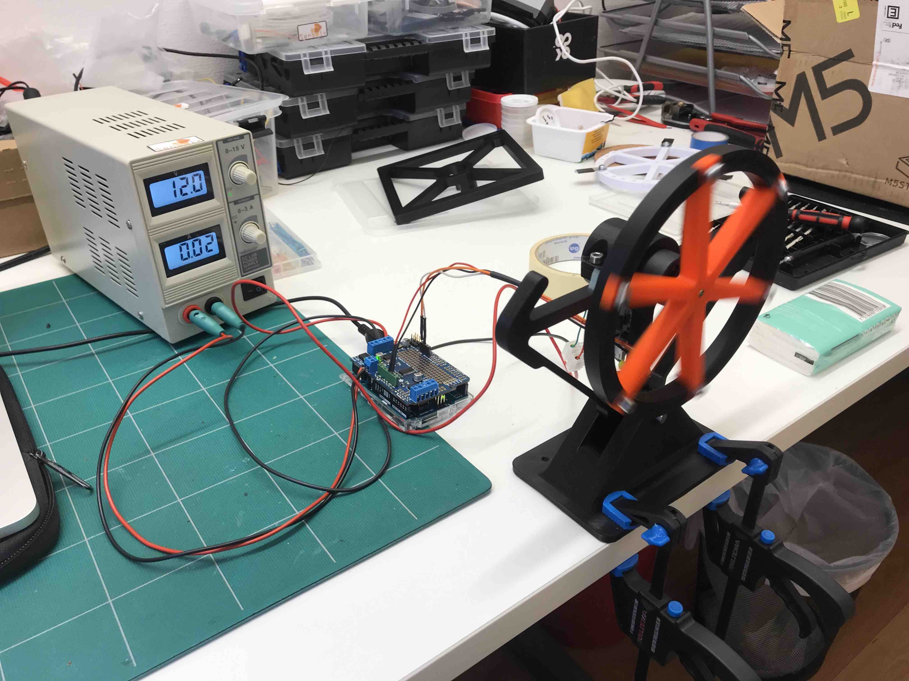

# Reaction wheel inverted pendulum

This repository contains the code, schematics and the report for a school project course in Control Systems. The design, implementation and tuning of the controller was done by me with Arduino code. Much of the other parts of the project was handled by others in the group including design and creation of the physical parts as well as simulations in Matlab.

